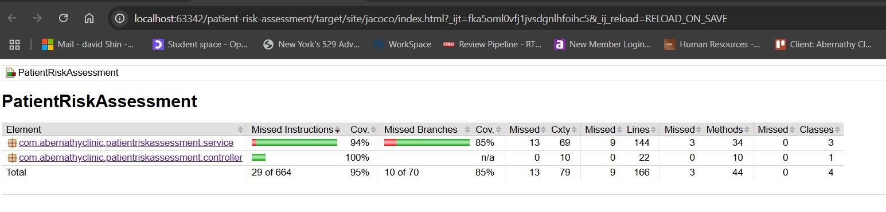

# Patient Diabetes Risk Assessment Service at Abernathy Clinic

## 1. Project Description

This is a Spring Boot orchestrator service designed for assessing a patient's diabetes risk based on data aggregated from multiple sources within Abernathy Clinic. This service fetches patient demographics and clinical notes from two backend services to perform the risk assessment. It does not have its own persistent data store.

**Controller:** `PatientRiskAssessmentController.java` located in the project's controller package.
**Data Transfer Objects (DTOs):**
- `PatientRecordsDTO`, `PatientRecordDTO`, and `ClinicalNoteDTO`: Used for receiving patient clinical record data from the `abernathy-clinic-patient-record` service.
- `PatientListDTO` and `PatientDTO`: Used for receiving patient demographic data from the `patient-demographics-api` service.

## 2. Docker Deployment

This project can be easily deployed using Docker Compose, which will also bring up its dependent backend services. Ensure you have Docker and Docker Compose installed on your system.

**Steps:**

1.  **Package the backend applications:** Navigate to the root directories of both the `patient-demographics-api` and `abernathy-clinic-patient-record` projects in your terminal and run the following Maven command in each:
    ```bash
    mvn clean package
    ```
    This will create the necessary build artifacts for the backend applications.

2.  **Build and run all services:** From the root directory of **this** `patient-risk-assessment` project (where the `docker-compose.yaml` file is located), run the following command:
    ```bash
    docker-compose up -d
    ```
    This command will build the Docker images (if they don't exist) and start the risk assessment service along with the patient demographics API, the clinical records API, and their respective databases (PostgreSQL and MongoDB).

**`docker-compose.yaml`:**
```yaml
version: "3.8"

services:
  patient-risk-assessment:
    image: patient-risk-assessment
    build: .
    ports:
      - "8080:8080"
    depends_on:
      - patient-demographics-api
      - abernathy-clinic-patient-record
    networks:
      - patient-services-network

  patient-demographics-api:
    image: docker-spring-boot-postgres:latest
    build: ../patient-demographics-api
    ports:
      - "8081:8081"
    depends_on:
      - db
    environment:
      - SPRING_DATASOURCE_URL=jdbc:postgresql://db:5432/compose-postgres
      - SPRING_DATASOURCE_USERNAME=compose-postgres
      - SPRING_DATASOURCE_PASSWORD=compose-postgres
      - SPRING_JPA_HIBERNATE_DDL_AUTO=update
    networks:
      - patient-services-network

  db:
    image: 'postgres:13.1-alpine'
    ports:
      - "15432:5432"
    container_name: db
    environment:
      - POSTGRES_USER=compose-postgres
      - POSTGRES_PASSWORD=compose-postgres
    networks:
      - patient-services-network

  abernathy-clinic-patient-record:
    image: abernathy-clinic-patient-record
    build: ../abernathy-clinic-patient-record
    ports:
      - "8082:8082"
    depends_on:
      - mongo
    environment:
      SPRING_DATA_MONGODB_URI: mongodb://mongo:27017/abernathy_clinic
    networks:
      - patient-services-network

  mongo:
    image: mongo:latest
    ports:
      - "27017:27017"
    volumes:
      - mongo-data:/data/db
    networks:
      - patient-services-network

volumes:
  mongo-data:

networks:
  patient-services-network:
    name: patient-services-network
```

The risk assessment service will be accessible at http://localhost:8080. The backend APIs and databases will be accessible on their respective ports.

## 3. Testing the Risk Assessment Service

You can trigger the patient risk assessment using the following API endpoints:

### Fetch by Family Name:

Send GET requests to the `/assess/familyName` endpoint with the `familyName` parameter:

- `http://localhost:8080/assess/familyName?familyName=testnone`
- `http://localhost:8080/assess/familyName?familyName=testborderline`
- `http://localhost:8080/assess/familyName?familyName=testindanger`
- `http://localhost:8080/assess/familyName?familyName=testearlyonset`

### Fetch by ID:

Send a GET request to the `/assess/id` endpoint with the `patId` parameter. **Note:** The result of this request depends on the data present in the backend patient demographics and clinical records services for the given `patId`.

- `http://localhost:8080/assess/id?patId=11`

By calling these endpoints, you can test the risk assessment service's ability to fetch data from the backend services and perform the assessment.

## 4. JaCoCo Report




## 5. Minimum Java Version

This project requires **Java 21** or a later version to run. Please ensure that your Java environment meets this minimum requirement.